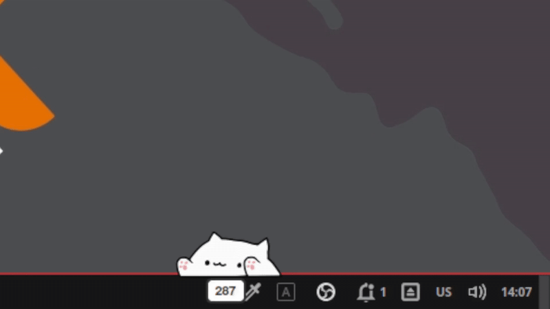

# Bongo Cat Overlay 

Bongo Cat overlay for streamers or just for fun. It tracks your keyboard and mouse activity and displays an animated cat on your screen.

## Features

- Tracks keyboard and mouse clicks.
- Counter for total clicks (saved in a local database).
- Supports scaling and rotation.
- Interactive window (can be moved by dragging).
- Mirrored mode activation after a certain number of clicks.

## Installation

### Linux

To install Bongo Cat and set it up as a system-wide command, follow these steps:

1. **Quick Install (curl | bash):**

   ```bash
   curl -sSL https://raw.githubusercontent.com/queendekim/bongocat/master/install.sh | sudo bash
   ```

   **Or install manually:**

   ```bash
   git clone https://github.com/queendekim/bongocat
   cd bongocat
   chmod +x install.sh
   ./install.sh
   ```

2. **Environment Path:**
   The script installs the `bongocat` command to `/usr/local/bin`. This directory is usually already in your `PATH`. If it's not, you can add it to your `.bashrc` or `.zshrc`:

   ```bash
   export PATH="/usr/local/bin:$PATH"
   ```

3. **Post-Installation (Linux):**
   The installer adds your user to the `input` group and sets up udev rules. **You MUST logout and login again** (or restart) for these changes to take effect and run Bongo Cat without `sudo`.


### Windows Build Instructions

### Automatic Build (GitHub Actions)

This repository is configured with GitHub Actions. Every time you push code to the `master` branch, a Windows executable is automatically built. You can find it in the **Actions** tab of your repository under the latest successful workflow run as an "Artifact".

### Manual Build

If you want to build the executable manually on Windows:

1.  Install Python 3.10+.
2.  Install dependencies:
    ```bash
    pip install -r requirements.txt
    ```
3.  Run PyInstaller using the provided spec file:
    ```bash
    pyinstaller --clean BongoCat.spec
    ```
4.  Find the executable in the `dist/` folder.


## Preview



## Uninstallation

### Linux

To remove Bongo Cat from your system, run the installer with the `-u` flag:

```bash
sudo /opt/bongocat/install.sh -u
```

### Windows

Simply delete the `BongoCat.exe` file and the `.bongocat_stats.db` file in your user directory.

## Usage

### Linux

Run the overlay using the command:

```bash
sudo bongocat
```

*Note: On Linux, Bongo Cat requires root privileges to capture keyboard and mouse events. The application automatically detects your real user's home directory to save settings when run with `sudo`.*

### Windows

Double-click `BongoCat.exe`. No administrator privileges are required for basic usage on Windows.

### Options

- `-s`, `--scale=<n>`: Scale factor (0-1) [default: 1.0]
- `-r`, `--rotate=<deg>`: Rotation in degrees (-360 to 360) [default: 0]
- `-p`, `--counter-position=<pos>`: Position of the counter (`top` or `bottom`) [default: bottom]

Example:
```bash
bongocat --scale=0.8 --rotate=180 --counter-position=top
```

### Controls

- **Drag with Mouse**: Move the window around your screen.
- **Shift + F4**: Close the application.

## Customization

You can customize the images by modifying the files in `/opt/bongocat/images/kb-mouse/`.  
- `idle.png`: The neutral state.
- `l.png` and `r.png`: The states for left and right paw actions.

## License

This project is licensed under the MIT License - see the [LICENSE](./LICENCE) file for details.

## Additional information

This project is based on the [Exahilosys/bongocat](https://github.com/Exahilosys/bongocat) repository.
